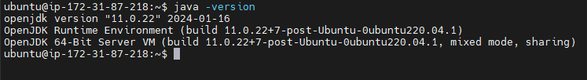
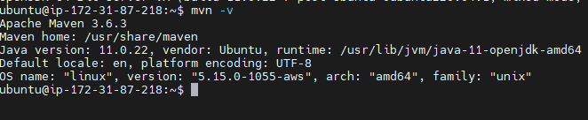
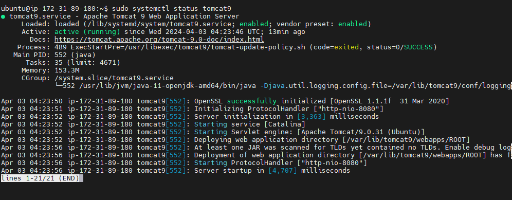
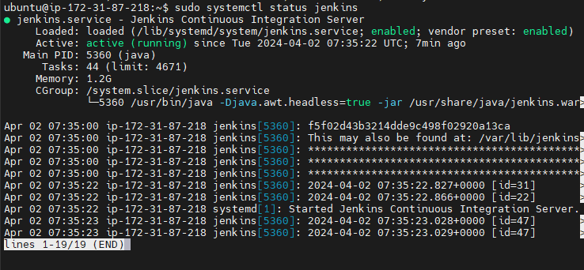
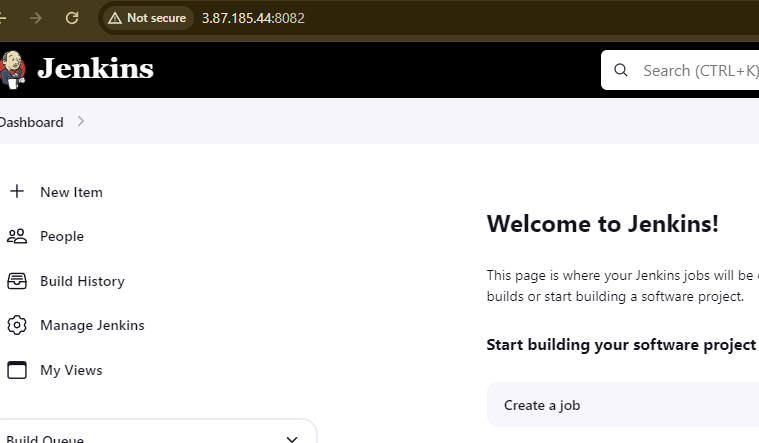
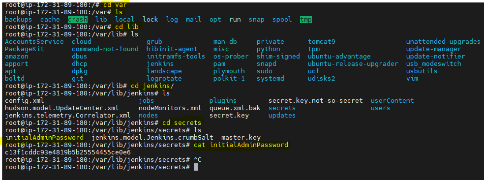
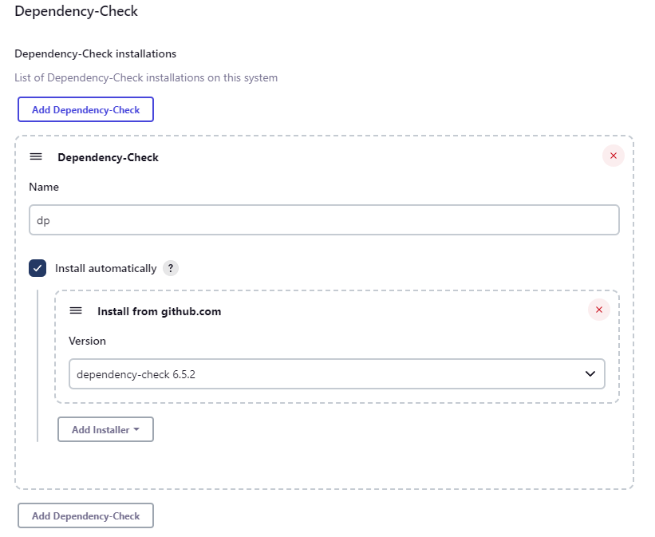

# Create a Jenkins Server with Terraform

- In this project we will use Terraform features to create Jenkins server and we will change the Jenkins server from default which is 8080 to custom (8082) with using user-data.sh script.
  
- We will create a jenkins server with Terraform and install Maven & Java 11

- Security group will allow us to open SSH:22, TCP :8080 (For Tomcat which we will install manuelly), TCP:8082 for Jenkins 

- We used userdata.sh file to install Jenkns, Java and Maven -> https://github.com/sinemozturk/Jenkins-server-with-Terraform/blob/main/userdata.sh


# Terraform 

- Simply download and modify the `main.tf`file on your choice.
- You may neeed change the region, instane
- You need to change the key-pair name it should be match with your AWS account.
- Make sure you have `ACCESS KEY` and `SECRET KEY` is written somewhere on your computer if not you can go to console and create one.

- Terraform Steps:
    - First initilize of your terraform file with   `terraform init` cmd on your CLI
    - You can provide your credentials via the AWS_ACCESS_KEY_ID and AWS_SECRET_ACCESS_KEY, environment variables, representing your AWS Access Key and AWS Secret Key, respectively.
      
 ```bash
export AWS_ACCESS_KEY_ID="anaccesskey"
export AWS_SECRET_ACCESS_KEY="asecretkey"
```
  - See if everything is working correctly with  `terraform plan` command.
  - If all is fine apply terraform with  `terraform apply -auto-approve` command. 


# INTALL JENKINS, JAVA, MAVEN 

- As we know Jenkins is using Port `8080 ` as default we will change to `8082`.

- First of all we need to ssh into Jenkins Server and check if everything is working correctly or not? 

- Check if Java is installed

```bash
java -version
```



- Check if Maven is installed

```bash
mvn -v
```



- Check if Tomcat is installed

```bash
sudo systemctl status tomcat9
```



- Check if Jenkins is running

```bash
sudo systemctl status jenkins
```


- To check is jenkins working correctly on port 8082 go to browser and type your link like following:

```text
http://<<public-ip-of-your-ec2:8082>>
```



- As you can see we successfully make the port change from 8080 to 8082 now we need to set up jenkins with initial administration password, go to related file with following;

```bash
cd /var/lib/jenkins/secrets
```

```bash
cat initialAdminPassword
```



- Now go into the jenkins and paste the password and create an admin account, you can see detailed explanation and installation of Jenkins on my github - > https://github.com/sinemozturk/Jenkins-CI-CD-Pipeline


# Jenkins Plugins Should be Installed; 

- Go to `Manage Jenkins` tab, and navigate `Manage Plugins` this is the place where actually you can download project related tools and technologies' plugins. Navifate to `Available Plugins` tab.
    - write `jdk` on search bar and click and install without restart following plugins;
        - `Eclipse Temurin installer`
        - `openJDK-native-plugin `

    - write ` owasp ` on search bar and click and install without restart following plugins;
        - `OWASP Dependency-CheckVersion 5.5.0 `  
    - write ` docker ` on search bar and click and install without restart following plugins;
        - `Docker`
        - `Docker Pipeline`
        - `docker-build-step`
        - `CloudBees Docker Build and Publish`
    - write ` sonarqube ` on search bar and click and install without restart following plugins;
        - `SonarQube Scanner `


## Global Tool Configuration

In Jenkins, the "Global Tool Configuration" section allows administrators to configure and manage global tools that can be used across all Jenkins jobs. These tools typically include build tools, version control tools, JDK installations, and other command-line utilities required for software development and build processes.

- Navigate the `Global Tool Configuration` bar on dashboard. We will configure Java, Maven, Docker and Dependency-Check.

    

    - For Java `JDK` give name as `jdk`, click `Install automatically` and choose the version of jdk. You can see in details with following; 

        

    - For Maven  give name as `maven`, click `Install automatically` and choose the version of maven. You can see in details ;

        

    - For Dependency-Check give name as `dp`, click `Install automatically` and choose the version of maven. You can see in details ;

        

    - For Docker give name as `docker`, click `Install automatically` and choose the version of maven. You can see in details ;

        


    - Save and Apply changes. 

# INSTALL APACHE TOMCAT 


- We need to install Apache Tomcat with following bash command; 

```bash
sudo wget https://archive.apache.org/dist/tomcat/tomcat-9/v9.0.65/bin/apache-tomcat-9.0.65.tar.gz
```

- As you can see above file extention is tar.gz , it is a zip file which we need to extract it. 

```bash
sudo tar -xvf apache-tomcat-9.0.65.tar.gz
```

- As you can see we have lots of files inside the conf folder. Now we need to make some changes in the tomcat server to make sure Tomcat is allowing the administrative access through its web interface by adding a new user with appropriate roles to the  `tomcat-user.xml` configuration file. Run following command to start making changes.

```bash
sudo vi tomcat-users.xml
# ---add-below-line at the end (2nd-last line)----
# <user username="admin" password="admin1234" roles="admin-gui, manager-gui"/>
```
- Now we need to create a symbolic link allows for easier access to the Tomcat `startup` script, enabling users to start Tomcat by simply executing startTomcat from the command line, without needing to navigate to the Tomcat installation directory.


```bash
sudo ln -s /opt/apache-tomcat-9.0.65/bin/startup.sh /usr/bin/startTomcat
```
- Now we need to create a symbolic link allows for easier access to the Tomcat `shutdown` script, enabling users to stop Tomcat by simply executing stopTomcat from the command line, without needing to navigate to the Tomcat installation directory.

```bash
sudo ln -s /opt/apache-tomcat-9.0.65/bin/shutdown.sh /usr/bin/stopTomcat
```

- Now we need to configure the  `context.xml` file with following command; 


```bash
sudo vi /opt/apache-tomcat-9.0.65/webapps/manager/META-INF/context.xml
```

- We need to comment following scripts :

```
 <Valve className="org.apache.catalina.valves.RemoteAddrValve"
         allow="127\.\d+\.\d+\.\d+|::1|0:0:0:0:0:0:0:1" />
```

- Now we need to configure the host-manager in the `context.xml` file. This file typically contains configuration settings specific to the host-manager web application in Apache Tomcat.

```bash
sudo vi /opt/apache-tomcat-9.0.65/webapps/host-manager/META-INF/context.xml
```

- Same steps with above comment the following scripts : 

```
<!-- Valve className="org.apache.catalina.valves.RemoteAddrValve"
  allow="127\.\d+\.\d+\.\d+|::1|0:0:0:0:0:0:0:1" /> -->
```


- Now we need to stop the Tomcat which was running when we used previous commands.The command `sudo stopTomcat` appears to be an attempt to stop the Apache Tomcat server using a custom command stopTomcat that you may have created earlier with the `ln` command. This command would work if you have created a `symbolic link` named stopTomcat that points to the `shutdown.sh` script in the Tomcat bin directory, as discussed earlier.


```bash
sudo stopTomcat
```


- Now we can start the Tomcat with following command;

```bash
sudo startTomcat
```


